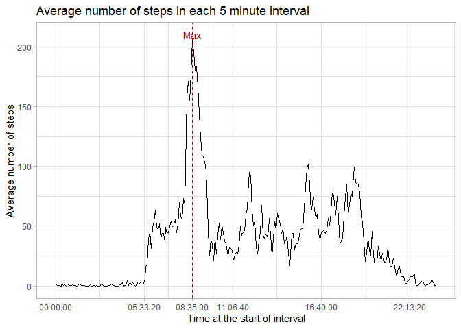

## Loading and preprocessing the data

First step is to download the data and unzip it.


```r
require(lubridate)
require(tidyverse)
require(hms)
url<-"https://d396qusza40orc.cloudfront.net/repdata%2Fdata%2Factivity.zip"
temp<-tempfile()
if(!dir.exists("./data/")) dir.create("./data/")
download.file(url, temp)
Sys.time() ## Register at which point the data was accessed
```

```
## [1] "2023-03-14 03:13:54 -03"
```

```r
unzip(temp,exdir="./data/")
unlink(temp)
dir("./data/")
```

```
## [1] "activity.csv"
```

From the above we can see that the zip file only had a .csv file in it. Let's check the first few lines to get a feel for the data.


```r
readLines("./data/activity.csv", n = 5)
```

```
## [1] "\"steps\",\"date\",\"interval\"" "NA,\"2012-10-01\",0"            
## [3] "NA,\"2012-10-01\",5"             "NA,\"2012-10-01\",10"           
## [5] "NA,\"2012-10-01\",15"
```

The first line is a header and that missing values are represented by "NA".


```r
## The read.csv function already has by default the argument na.strings = "NA"
activity<-read.csv("./data/activity.csv")
str(activity)
```

```
## 'data.frame':	17568 obs. of  3 variables:
##  $ steps   : int  NA NA NA NA NA NA NA NA NA NA ...
##  $ date    : chr  "2012-10-01" "2012-10-01" "2012-10-01" "2012-10-01" ...
##  $ interval: int  0 5 10 15 20 25 30 35 40 45 ...
```

Couple of things can be noticed here. The second variable, "date" is expressed in characters, to make the analysis easier, that should be changed.


```r
activity %>% as_tibble() %>% mutate(date = ymd(date)) -> activity
## checking for NA's in interval or date
anyNA(activity$interval) | anyNA(activity$date)
```

```
## [1] FALSE
```

```r
activity
```

```
## # A tibble: 17,568 × 3
##    steps date       interval
##    <int> <date>        <int>
##  1    NA 2012-10-01        0
##  2    NA 2012-10-01        5
##  3    NA 2012-10-01       10
##  4    NA 2012-10-01       15
##  5    NA 2012-10-01       20
##  6    NA 2012-10-01       25
##  7    NA 2012-10-01       30
##  8    NA 2012-10-01       35
##  9    NA 2012-10-01       40
## 10    NA 2012-10-01       45
## # … with 17,558 more rows
```

Next, by looking at the "interval" variable, we can surmise that it's referring to the initial time, in hours, in which the interval began. For example, 0, refers to 00:00, and 2355 to 23:55. It's reasonable to conclude that it's not an independent variable from "data", therefore, we should aim to tidy the data set by combining them both.


```r
## there are 288 intervals of 5 minutes in a day
time <- NULL
for (i in 0:287){
        time[i+1]<-60*5*i ## 5 minute intervals in a day in seconds
}
time<-rep(time, length.out = 17568) ## number of lines in the data
foo<-activity$date+seconds(time)
activity %>% mutate(initial.time = foo, end.time = foo + minutes(5)) %>%
        select(steps,initial.time, end.time) -> activity
rm(list = c("i","foo")) ## deleting variables that are no longer needed
head(activity)
```

```
## # A tibble: 6 × 3
##   steps initial.time        end.time           
##   <int> <dttm>              <dttm>             
## 1    NA 2012-10-01 00:00:00 2012-10-01 00:05:00
## 2    NA 2012-10-01 00:05:00 2012-10-01 00:10:00
## 3    NA 2012-10-01 00:10:00 2012-10-01 00:15:00
## 4    NA 2012-10-01 00:15:00 2012-10-01 00:20:00
## 5    NA 2012-10-01 00:20:00 2012-10-01 00:25:00
## 6    NA 2012-10-01 00:25:00 2012-10-01 00:30:00
```

```r
tail(activity)
```

```
## # A tibble: 6 × 3
##   steps initial.time        end.time           
##   <int> <dttm>              <dttm>             
## 1    NA 2012-11-30 23:30:00 2012-11-30 23:35:00
## 2    NA 2012-11-30 23:35:00 2012-11-30 23:40:00
## 3    NA 2012-11-30 23:40:00 2012-11-30 23:45:00
## 4    NA 2012-11-30 23:45:00 2012-11-30 23:50:00
## 5    NA 2012-11-30 23:50:00 2012-11-30 23:55:00
## 6    NA 2012-11-30 23:55:00 2012-12-01 00:00:00
```

The data above looks tidy, and so we can proceed with the analysis.

## What is the mean total number of steps taken per day?

To calculate this, we will have to get the date from the initial.time variable, group the data set by each date and get the mean of steps in each day.

First, let's plot the histogram of steps per day, note that some days don't have any steps due to only missing values being available in the data.

```r
activity %>% mutate(date = date(initial.time)) -> activity
activity %>% group_by(date) -> bydate 
bydate %>% select(steps,date) %>% summarise(count = sum(steps, na.rm = TRUE)) ->
        bydate
bydate %>% ggplot(aes(x=count)) + xlab("Steps per day") + ylab("Frequency") +
        ggtitle("Histogram of number of steps per day") + geom_histogram(bins = 61) + theme_light()
```

<!-- -->

With the data prepared, taking the mean and the median of the steps per day is simple.


```r
summary(bydate$count)
```

```
##    Min. 1st Qu.  Median    Mean 3rd Qu.    Max. 
##       0    6778   10395    9354   12811   21194
```
## What is the average daily activity pattern?

Let's create a time series plot that takes the average of steps in each time-interval.


```r
activity %>% mutate(hms = as_hms(initial.time)) %>% group_by(hms) %>%
        summarise(mean = mean(steps, na.rm = TRUE)) -> byhms 
byhms %>% ggplot(aes(x = hms, y = mean)) + geom_line() + 
        xlab ("Time at the start of interval") + 
        ylab ("Average number of steps") +
        ggtitle ("Average number of steps in each 5 minute interval") +
        geom_vline(xintercept = byhms$hms[which.max(byhms$mean)],
                   colour = "#990000",
                   linetype = "dashed", show.legend = TRUE) +
        theme_light () +
        annotate("text", x = byhms$hms[which.max(byhms$mean)], 
                 y = 210, 
                 colour = "#990000",
                 label = "Max") +
        scale_x_time(breaks = sort(c(as_hms("08:35:00"),
                                     as_hms(pretty(range(as_hms("00:00:00"),
                                           as_hms("23:59:59")))))))
```

<!-- -->

Now, which 5-minute period is the one with the highest average steps taken?

```r
byhms$hms[which.max(byhms$mean)]
```

```
## 08:35:00
```

## Imputing missing values

To start, let's calculate how many missing values there are.

```r
## when we created the date variable, we checked for NA's in interval
sum(is.na(activity$steps))
```

```
## [1] 2304
```

Now lets sort the data by time interval and get the median for each value.


```r
median <- activity %>% mutate(hms = as_hms(initial.time)) %>% group_by(hms) %>%
        summarise (median = median(steps,na.rm = TRUE))
```

Now lets mutate the original tibble to add the missing values in.


```r
activity %>% mutate (time = as_hms(initial.time)) %>% 
        left_join(median, by = join_by(time == hms)) %>%
        ## check if steps is na, if it is, get the median, if not, get steps
        mutate(steps = ifelse(is.na(steps),median,steps)) -> activity
```

## Are there differences in activity patterns between weekdays and weekends?

Let's create the weekend boolean


```r
activity %>% mutate(weekend =
                            wday(activity$initial.time) == 1 |
                            wday(activity$initial.time) == 7) -> activity
```

Now, lets explore the data when grouped by weekend


```r
 activity %>% mutate (hms = as_hms (initial.time)) %>%
         group_by(hms,weekend) %>%
         summarise (steps = sum(steps, na.rm = TRUE)) %>%
         group_by(weekend) %>% summarise (mean = mean(steps)) -> mean.by.weekend
#activity %>% group_by(weekend) %>% summarise (mean = mean(steps)) -> mean.by.weekend

activity %>% mutate (hms = as_hms(initial.time)) %>% group_by(hms, weekend) %>%
        summarise(steps = sum (steps, na.rm = TRUE)) %>%
        ggplot(aes(color = weekend, x = hms, y = steps)) +
        geom_line() +
        theme_light() +
        xlab("Time of day") +
        ylab("Number of steps") +
        ggtitle("Daily activity", "Comparison between weekdays and weekends") +
        ## plotting the mean for weekdays
        ## false first
        geom_hline (aes(yintercept = mean.by.weekend[[1,2]],
                        linetype = "Mean of Weekday"),
                    color = "red") +
        geom_hline (aes(yintercept = mean.by.weekend[[2,2]],
                        linetype = "Mean of Weekend"),
                    color = "cyan") +
        scale_colour_discrete(name = "Weekend") +
        scale_linetype_manual(name = "Measure", values = c("dashed","dashed"), 
                              guide = guide_legend(override.aes=list(color = c("red","cyan"))))
```

<!-- -->

From the data above we can conclude that there are differences between the activity patterns during the weekend and during weekdays. It looks like the subject is more active during weekdays, particularly in the morning, which contributes to a higher average steps taken.
